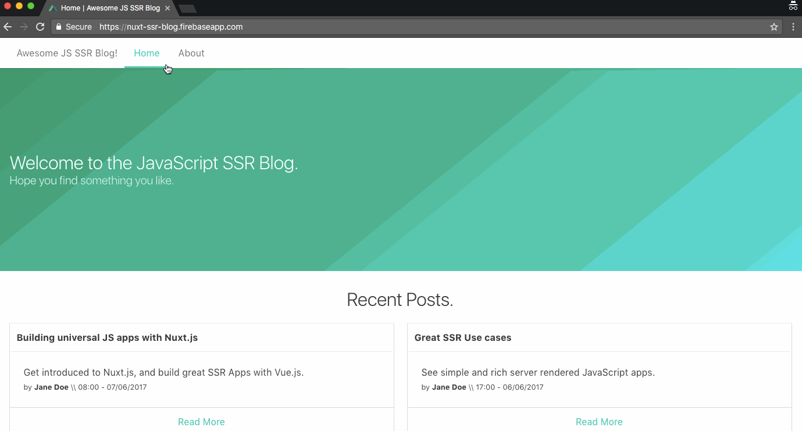

https://www.sitepoint.com/nuxt-js-universal-vue-js/

# Nuxt.js - универсальный Vue.js фреймворк

Универсальный (или изоморфный) JavaScript - термин, который стал очень популярным в JavaScript-сообществе в последнее время. Если описать суть термина в двух словах, то это такой JavaScript-код, который может быть запущен как на стороне, так и на стороне клиента.

Многие современные JavaScript-фреймворки, как например [Vue.js](https://vuejs.org/), были спроектированы для создания одностраничных приложений (SPA). Такой подход позволил улучшить user experience и сделать работу приложений значительно быстрее благодаря тому, что страница, с которой работает пользователь, непрерывно обновляется.

Несмотря на то, что такой подход имеет массу преимуществ, у него есть и пара недостатков, таких как долгое "время загрузки контента", когда происходит первоначальная загрузка приложения и браузер получает целиком весь JavaScript приложения. Второй недостаток заключается в том, что сетевые роботы социальных сетей и web crawlers поисковых систем не могут просканировать все приложение целиком, когда они инспектируют web-страницы.

Технология Server Side Rendering заключается в том, что JavaScript первоначально загружается на стороне сервера, а затем сервер отправляет сгенерированные HTML-страницы в ответ на запрос браузера.

Создание JavaScript-приложений с поддержкой SSR является достаточно трудоемким занятием, так как требуется выполнить много настроек перед тем, как начать сам процесс создания приложения. С такой проблемой при создании приложений на Vue.js поможет справиться библиотека [Nuxt.js](https://nuxtjs.org/).

## Что такое Nuxt.js

Если сказать в двух словах, то Nuxt.js - это фреймворк, помогающий создавать приложения на Vue.js с поддержкой SSR более просто и легко. Внутри Nuxt.js заложены такие базовые возможности, как маршрутизация, поддержка сторонних приложений и асинхронные данные. Nuxt.js похож на [Angular Universal](https://universal.angular.io/) под [Angular](https://angular.io/) и [Next.js](https://zeit.co/blog/next2) под [React](https://facebook.github.io/react/).

Как говорится в [официальной документации Nuxt.js](https://nuxtjs.org/guide "Nuxt.js Guide"), "its main scope is UI rendering while abstracting away the client/server distribution".

## Статическая генерация

Еще одной замечательной возможностью фреймворка Nuxt.js является возможность генерации статических веб-сайтов при помощи команды `generate`. Это замечательный инструмент и по своим возможностям он очень похож на другой популярный сервис для генерации статических страниц - [Jekyll](https://jekyllrb.com/ "Jekyll").

## Что у Nuxt.js под капотом

В дополнение к Vue.js 2.0 фреймворк Nuxt.js имеет в своем составе [Vue-Router](https://github.com/vuejs/vue-router), [Vue-Meta](https://github.com/declandewet/vue-meta) и [Vuex](https://github.com/vuejs/vuex) ( включен в сборку только если включена [опция store](https://nuxtjs.org/guide/vuex-store) ). И это просто отлично, так как это избавляет разработчика от необходимости вручную настраивать сторонние библиотеки, необходимые для разработки Vue.js приложения с поддержкой Server Rendered. В Nuxt.js поддержка этих библиотек есть "из коробки" и при этом общий размер архива составляет 28kb (31kb с Vuex).

Фреймворк Nuxt.js также использует [Webpack](https://github.com/webpack/webpack) совместно с [vue-loader](https://github.com/vuejs/vue-loader) и [babel-loader](https://github.com/babel/babel-loader) для сборки, минификации и разделения кода.

### Как это работает

Ниже описаны ключевые моменты работы приложения, созданного при помощи Nuxt.js. Ситуация, когда пользовать перемещается по страницам этого приложения при помощи тегов `<nuxt-link>`:

  1. когда пользователь первоначально запускает приложение, если в этом приложении в его store определен [action nuxtServerInit](https://nuxtjs.org/guide/vuex-store/#the-nuxtserverinit-action), то Nuxt.js вызывает на исполнение этот action и обновляет store
  2. затем фреймворк вызывает на исполнение сторонее приложение [middleware](https://nuxtjs.org/guide/routing/#middleware), если это приложение присутствует на посещаемой странице. Nuxt.js сначала проверяет файл `nuxt.config.js` на наличие глобальных middleware, затем проверяет их на соответствие файлу разметки [layout file](https://nuxtjs.org/guide/views#layouts) (для запрашиваемых страниц) и затем проверяет страницы и их потомков на предмет наличия middleware - приоритет middleware задается именно в таком порядке.
  3. если маршрут route, по которому переходит пользователь, является динамическим и для этого маршрута задан метод `validate()`, то этот маршрут [вилидируется](https://nuxtjs.org/api/pages-validate)
  4. Затем Nuxt.js вызывает методы `asyncData()` и `fetch()` для загрузки данных прежде, чем будет сгенерирована страница. Метод [asyncData()](https://nuxtjs.org/guide/async-data/) используется для получения данных и рендеринга их на стороне сервера; в то время как метод [fetch](https://nuxtjs.org/api/pages-fetch/) is used to fill the store before rendering the page
  5. На финальном этапе, страница, содержащая в себе все необходимые данные, вызывается на рендеринг в браузере.

Все описанные выше действия в точности повторяют схему, доступную на странице официальной документации Nuxt.js:

## Создание статичного сайта на Nuxt.js

Давайте напишем немного кода и создадим простой блог статичных страниц при помощи Nuxt.js. Будем предполагать, что данные всех постов в блоге будут передаваться по API.

Для дальнейшей работы нам потребуются знания по фреймворку Vue.js и базовые знания синтаксиса ES6. Приложение в его окончательном варианте будет выглядеть таким образом:

